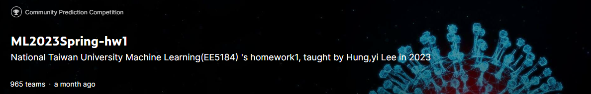
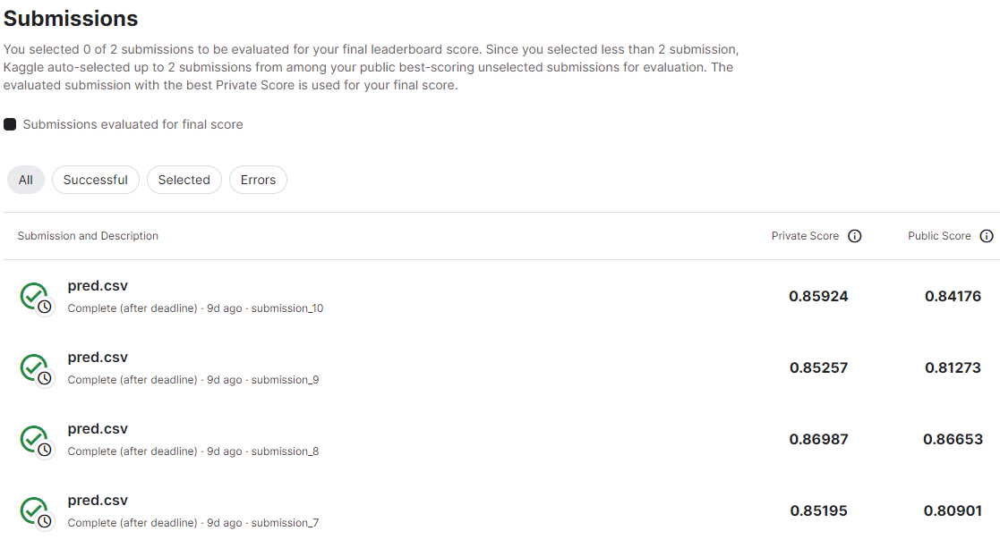
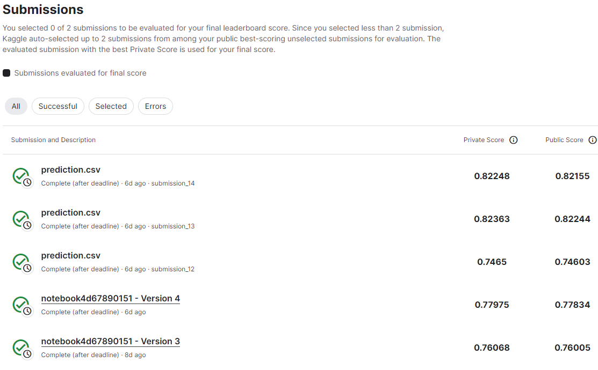
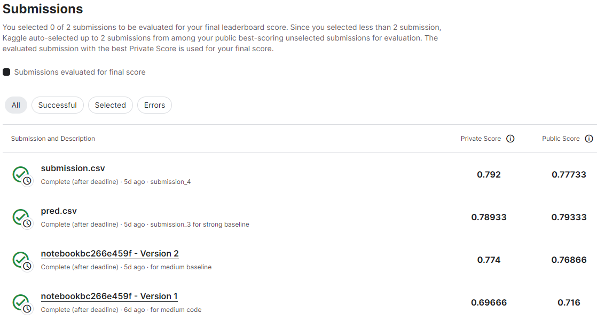
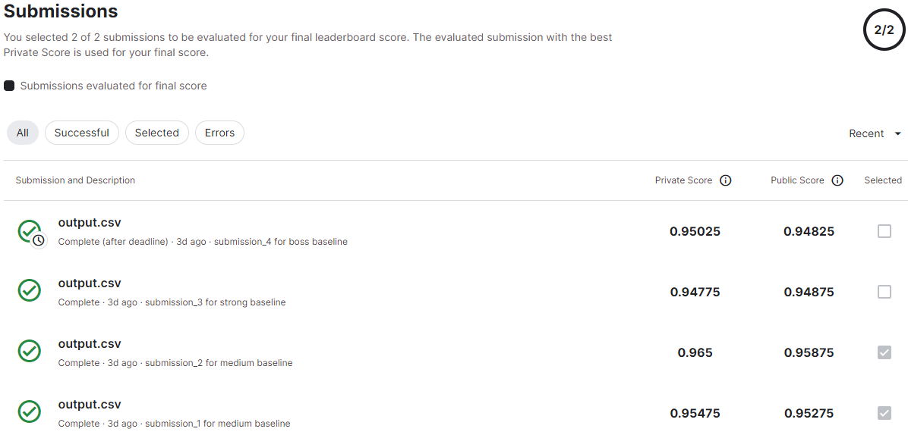

# ML2023-Spring-Hung-Yi-Lee-Solutions

## HW01
- **训练一个分类器预测下一天的新冠肺炎死亡人数**

- **预测结果**

## HW02
- **训练一个分类器识别 41 个类别的音素**

- **预测结果**

## HW03
- **图像识别任务**

- **预测结果**

## HW04
- **说话人识别任务**

- **预测结果**

